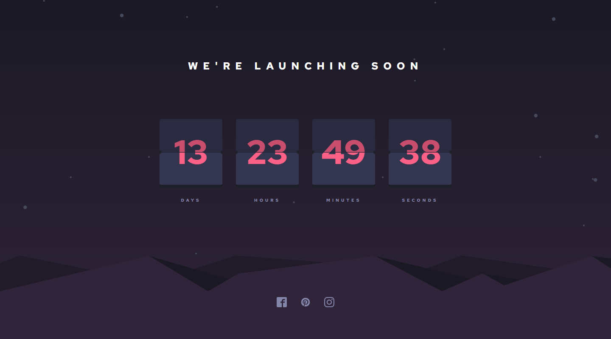

# Frontend Mentor - Launch countdown timer solution

This is a solution to the [Launch countdown timer challenge on Frontend Mentor](https://www.frontendmentor.io/challenges/launch-countdown-timer-N0XkGfyz-). Frontend Mentor challenges help you improve your coding skills by building realistic projects. 

## Table of contents

- [Overview](#overview)
  - [The challenge](#the-challenge)
  - [Screenshot](#screenshot)
  - [Links](#links)
- [My process](#my-process)
  - [Built with](#built-with)
  - [What I learned](#what-i-learned)
  - [Useful resources](#useful-resources)
- [Author](#author)

## Overview

### The challenge

Users should be able to:

- See hover states for all interactive elements on the page
- See a live countdown timer that ticks down every second (start the count at 14 days)
- **Bonus**: When a number changes, make the card flip from the middle

### Screenshot

### Links

- Solution URL: [Add solution URL here](https://github.com/KamQuoss/lounch-countdown-timer)
- Live Site URL: [Add live site URL here](https://kamquoss.github.io/lounch-countdown-timer/)

## My process

### Built with

- Semantic HTML5 markup
- CSS custom properties
- Flexbox
- BEM methodology
- svg sprite
- flexibility using clamp
- [React](https://reactjs.org/) - JS library
- [Vite](https://vitejs.dev/) - JS library

### What I learned

- css transformation
- css animation
- css filters
- css clamp function
- css clip path
- js Date
- project hierarchy
- preparing environment with vite
- using svg sprites

In this project I found most challenging to make animation start once the number on flap display changes. I have solve this problem by toggling classes which starts animation on flap displays.
Another difficulty was managing time. I found that js intervals aren't very precise, so I've done some workaround. Every second the current time is checked and set as a Counter state.

### Useful resources

- [Using SVG sprites in a React app](https://dev.to/mbarzeev/using-svg-sprites-in-a-react-app-477d)
- [Clip path article](https://css-tricks.com/almanac/properties/c/clip-path/) - This is an amazing article which helped me finally understand XYZ. I'd recommend it to anyone still learning this concept.

## Author

- Frontend Mentor - [@KamQuoss](https://www.frontendmentor.io/profile/KamQuoss)
- LinkedIn - [Kamila Kłosek](https://www.linkedin.com/in/kamila-klosek/)